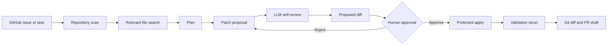

# RepoPilot Agent


RepoPilot Agent is a local coding workflow agent for turning GitHub issues, bug reports, or feature requests into reviewed, validated code-change proposals. It scans a repository, retrieves relevant files, plans the work, asks an optional OpenAI-compatible LLM for patch proposals, previews diffs, waits for human approval, applies approved edits, reruns validation, and summarizes the result.

The project is designed around practical agent engineering: tool use, repository understanding, Git/GitHub awareness, structured LLM outputs, traceability, and human-in-the-loop safety.

## Agent Workflow

```text
Task or GitHub issue
-> repository scan
-> relevant file search
-> deterministic or LLM plan
-> patch proposal
-> LLM self-review
-> proposed diff preview
-> human approval
-> protected file application
-> validation rerun
-> Git diff and PR draft support
```



## Highlights

- 🧭 Dependency-light Python implementation using the standard library for the current MVP.
- 🖥️ Local web UI for task input, LLM settings, proposal review, timelines, GitHub state, and diffs.
- 🧠 Optional OpenAI-compatible LLM integration with deterministic fallback.
- ✅ Strict LLM JSON schema parsing for plans, patch proposals, and patch reviews.
- 🔍 LLM call traces with prompt previews, raw outputs, parse status, fallback state, and latency.
- 🛡️ LLM self-review for proposed diffs before human approval.
- 🔐 Server-side proposal sessions so the browser applies proposals by `proposal_id`, not raw edits.
- 🧪 Validation command allowlist for safer test and lint execution.
- 🌿 Git workflow awareness for branch state, remotes, changes, diff stats, commit messages, and PR drafts.
- 🔗 GitHub awareness for open issues, pull requests, reviews, and CI/check status.
- 📦 Delivery draft panel for suggested commit messages, validation notes, and PR-ready text.

## Capability Map

| Area                   | What RepoPilot Does                                                                                   |
| ---------------------- | ----------------------------------------------------------------------------------------------------- |
| 📁 Repository scanning | Reads supported text files and ignores Git, dependency, build, cache, and local note paths.           |
| 🔎 Retrieval           | Scores files by task keywords and returns relevant file previews with match reasons.                  |
| 🧭 Planning            | Builds deterministic plans or LLM-generated engineering plans.                                        |
| 🧩 Patch proposal      | Produces file-level change intent, risk notes, validation suggestions, and optional LLM file edits.   |
| 🧠 LLM governance      | Centralizes prompts, validates schemas, records traces, and runs patch self-review.                   |
| 🖐️ Web approval      | Stores proposals server-side, previews proposed diffs, and applies approved proposals by ID.          |
| 🧪 Validation          | Runs allowlisted commands and reports stdout, stderr, exit code, and rejected commands.               |
| 🌿 Git                 | Inspects branch/upstream/ahead/behind, changed files, latest commit, diff stats, and delivery drafts. |
| 🔗 GitHub              | Reads issues, PRs, reviews, and CI/check status from the repository remote.                           |

## Architecture

```text
repopilot.py
  CLI entry point

src/repopilot_agent/
  scanner.py            repository file scanning
  search.py             lightweight relevance search
  planner.py            deterministic and LLM planning
  patch_proposer.py     patch proposal and LLM patch review
  patch_apply.py        protected file edit application
  workflow.py           end-to-end local workflow
  validator.py          allowlisted validation runner
  git_tools.py          local Git inspection
  git_summary.py        commit message and PR draft generation
  github_tools.py       GitHub REST API inspection
  web_server.py         local stdlib HTTP server
  web_sessions.py       in-memory proposal sessions and timeline events
  llm/
    base.py             provider protocol and message model
    openai_compatible.py OpenAI-compatible client
    prompts.py          prompt templates
    schema.py           strict JSON parsers
    tracing.py          LLM call tracing
```

## Quick Start

Run the local workflow from the project root:

```bash
python repopilot.py run --repo . --task "fix search relevance for login behavior"
```

Run with validation:

```bash
python repopilot.py run --repo . --task "fix search relevance for login behavior" --validate "python -m unittest discover -s tests"
```

Print JSON output:

```bash
python repopilot.py run --repo . --task "inspect validation workflow" --json
```

## Web UI

Start the local web UI:

```bash
python repopilot.py serve
```

Open:

```text
http://127.0.0.1:8765
```

The web UI supports:

- 🧠 LLM model, API base URL, and API key inputs.
- 📌 Task input and GitHub issue import.
- 🚦 Workflow execution and standalone proposal generation.
- 🔍 LLM input/output, self-review, and call trace inspection.
- 🕒 Agent timeline showing scan, search, plan, proposal, review, approval, apply, and validation events.
- 🧾 Proposed diff preview before file writes.
- 🖐️ Human-approved patch application by server-side `proposal_id`.
- 📦 Delivery draft generation for commit message and PR body preparation.
- 🔗 GitHub issue/PR/review/check display.
- 🌿 Working tree and staged diff display.

API keys entered in the UI are sent only to the local server for that request and are not written to disk.

## LLM Configuration

RepoPilot works without an LLM by using deterministic rules. To enable LLM-backed planning, patch proposals, and patch review:

```bash
python repopilot.py run --repo . --task "fix search relevance for login behavior" --use-llm
```

Use a specific model:

```bash
python repopilot.py run --repo . --task "fix search relevance for login behavior" --use-llm --model gpt-4o-mini
```

Disable deterministic fallback while debugging model output:

```bash
python repopilot.py run --repo . --task "fix search relevance for login behavior" --use-llm --no-llm-fallback
```

Environment variables:

- `OPENAI_API_KEY`: API key for the OpenAI-compatible provider.
- `OPENAI_BASE_URL`: Optional API base URL. Defaults to `https://api.openai.com/v1`.
- `REPOPILOT_MODEL`: Optional default model name.

## Git And GitHub

Inspect local Git state:

```bash
python repopilot.py git status --repo .
```

Generate a commit summary and PR draft:

```bash
python repopilot.py git summary --repo . --validation "python -m unittest discover -s tests"
python repopilot.py git pr-draft --repo . --validation "python -m unittest discover -s tests"
```

The web UI also includes a Delivery tab that generates the same kind of commit message and PR draft from the current working tree. It does not commit, push, or create pull requests.

Inspect GitHub issue, pull request, review, and CI state:

```bash
python repopilot.py github status --repo .
```

Print GitHub state as JSON:

```bash
python repopilot.py github status --repo . --limit 10 --json
```

The GitHub command resolves the repository from the local `origin` remote. Public repositories can be read without a token, but `GITHUB_TOKEN` or `GH_TOKEN` is recommended for private repositories and higher rate limits.

## Local Memory

RepoPilot stores local web workflow history in SQLite under:

```text
.repopilot/memory.sqlite3
```

The memory layer records run metadata, tasks, summaries, proposal metadata, proposed diffs, LLM traces, validation results, and timeline events. API keys are not stored. The web UI exposes this through the History tab, where previous runs can be inspected or reused as new tasks.

## Safety Model

RepoPilot is intentionally approval-first:

- ✅ It previews proposed diffs before writing files.
- 🔐 It applies only server-stored proposal edits by `proposal_id`.
- 🚧 It blocks repository escapes and sensitive paths such as `.git`, `.env`, and `log.md`.
- 🧪 It runs validation commands only through an allowlist.
- 🧯 It keeps deterministic fallbacks for invalid or unavailable LLM output.
- 🔍 It exposes LLM traces and self-review output so decisions are inspectable.

## Tests

Run the test suite:

```bash
python -m unittest discover -s tests
```

Compile-check Python files:

```bash
python -m py_compile repopilot.py src/repopilot_agent/*.py tests/test_workflow.py
```

## Roadmap

- 💾 Persist proposal sessions and trace history in SQLite.
- 🧩 Add per-file approval controls before applying proposals.
- 🚀 Add GitHub pull request creation after explicit user approval.
- 📏 Add context budget management for larger repositories.
- ⚙️ Move the web backend to FastAPI when dependency-light constraints are relaxed.
- 🖥️ Build a richer React or Next.js dashboard for multi-run history and team workflows.
- 🧪 Add benchmark tasks from real open-source issues.

## Status

RepoPilot Agent currently includes the CLI workflow, repository scanner, search layer, deterministic planner, optional LLM planner, strict LLM schema parsing, prompt templates, LLM call tracing, LLM patch proposal generation, LLM patch self-review, protected patch application, validation runner, Git workflow awareness, delivery draft generation, GitHub workflow awareness, SQLite-backed local memory, local web UI, proposal sessions, timeline events, root launcher, and unit tests.
