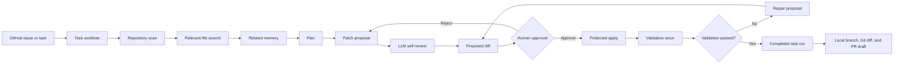

# RepoPilot Agent


[](https://github.com/CHOS1N11111/RepoPilot-Agent/actions/workflows/ci.yml)


RepoPilot Agent is a local coding workflow agent for turning GitHub issues, bug reports, or feature requests into reviewed, validated code-change proposals. It can create an isolated worktree for each task, scan the repository, retrieve relevant files, plan the work, ask an optional OpenAI-compatible LLM for patch proposals, wait for human approval, apply approved edits, rerun validation, and preserve the complete task state for recovery.

The project is designed around practical agent engineering: tool use, repository understanding, Git/GitHub awareness, structured LLM outputs, traceability, and human-in-the-loop safety.

## Agent Workflow

```text
Task or GitHub issue
-> isolated task worktree
-> repository scan
-> typed action-observation exploration
-> relevant file selection
-> related memory lookup
-> deterministic or LLM plan
-> patch proposal
-> LLM self-review
-> proposed diff preview
-> human approval
-> protected file application
-> validation rerun
-> validation feedback and repair proposal
-> resumable task completion
-> Git diff, PR readiness, and PR draft support
```



## Highlights

- 🧭 Dependency-light Python implementation using the standard library for the current MVP.
- 🖥️ Local web UI for task input, LLM settings, proposal review, timelines, GitHub state, and diffs.
- 🧠 Optional OpenAI-compatible LLM integration with deterministic fallback.
- Typed agent runtime for multi-step search, file reading, Git inspection, diff inspection, guarded edits, validation, user questions, and explicit finish actions.
- Ordered runtime events, action reservations, idempotent replay, and interruption recovery stored in local SQLite.
- Reproducible deterministic and LLM evaluation suites with explicit scoring and aggregate metrics.
- Managed detached Git worktree sandboxes for isolated proposal application and validation.
- Persistent sandboxed task runs with background execution, progress polling, safe pause/resume/cancel checkpoints, and restart recovery.
- ✅ Strict LLM JSON schema parsing for plans, patch proposals, and patch reviews.
- 🔍 LLM call traces with prompt previews, raw outputs, parse status, fallback state, and latency.
- 🧠 Local memory reuse for related previous runs, validation outcomes, and task summaries.
- 🧹 Memory controls for disabling lookup, deleting saved runs, and clearing local history.
- 📌 Pinned memory so users can prioritize important prior runs during planning.
- 🛡️ LLM self-review for proposed diffs before human approval.
- 🔐 Server-side proposal sessions so the browser applies proposals by `proposal_id`, not raw edits.
- 🧯 Rollback snapshots for reverting applied proposal edits without using destructive Git commands.
- 🧪 Validation command allowlist for safer test and lint execution.
- 🛠️ Validation feedback loop for failed tests, suspected files, and repair proposals.
- 🌿 Git workflow awareness for branch state, remotes, changes, diff stats, commit messages, PR readiness, and PR drafts.
- 🔗 GitHub awareness for open issues, pull requests, reviews, and CI/check status.
- 📦 Delivery draft panel for suggested commit messages, validation notes, PR readiness, PR-ready text, and explicit PR creation.

## Capability Map

| Area                   | What RepoPilot Does                                                                                   |
| ---------------------- | ----------------------------------------------------------------------------------------------------- |
| 📁 Repository scanning | Reads supported text files and ignores Git, dependency, build, cache, and local note paths.           |
| 🔎 Retrieval           | Scores files with task terms, path intent, symbols, multi-snippets, and source/test pairing.          |
| Agent runtime          | Executes typed tools, records action/observation events, and blocks unsafe automatic replay.          |
| Iterative agent        | Uses the runtime under a read-only policy for bounded exploration before planning.                    |
| 🧭 Planning            | Builds deterministic plans or LLM-generated engineering plans.                                        |
| 🧩 Patch proposal      | Produces file-level change intent, risk notes, validation suggestions, and optional LLM file edits.   |
| 🧠 LLM governance      | Centralizes prompts, validates schemas, records traces, and runs patch self-review.                   |
| 🧠 Memory              | Retrieves related and pinned local run history and feeds concise lessons into planning.                |
| 🖐️ Web approval      | Stores proposals server-side, previews diffs, applies approved proposals, and supports rollback.      |
| 🧪 Validation          | Recommends commands, runs allowlisted checks, analyzes failures, and prepares repair context.         |
| Evaluation             | Scores retrieval, proposals, validation, Agent steps, LLM calls, latency, failures, and fallbacks.    |
| Worktree sandbox       | Creates isolated committed snapshots and guards dirty-source and destructive-removal operations.      |
| Task orchestration     | Runs the Agent in a sandbox, persists progress, waits for approval, validates, repairs, and resumes.   |
| 🌿 Git                 | Inspects branch/upstream/ahead/behind, changed files, latest commit, diff stats, and PR readiness.    |
| 🔗 GitHub              | Reads issues, PRs, reviews, and CI/check status from the repository remote.                           |

## Architecture

```text
repopilot.py
  CLI entry point

src/repopilot_agent/
  scanner.py            repository file scanning
  search.py             lightweight relevance search
  agent_loop.py         LLM exploration adapter for the typed runtime
  runtime/
    models.py           action, observation, event, policy, and run contracts
    tools.py            typed repository, Git, edit, and validation tools
    store.py            in-memory and SQLite action/event persistence
    loop.py             reusable policy-gated action-observation loop
  planner.py            deterministic and LLM planning
  patch_proposer.py     patch proposal and LLM patch review
  patch_apply.py        protected file edit application and rollback snapshots
  safety.py             structured pre-apply safety checks
  workflow.py           end-to-end local workflow
  validator.py          allowlisted validation runner
  validation_planner.py recommended validation command planner
  validation_feedback.py validation failure analysis and repair task builder
  evaluation.py         reproducible case loading, workflow scoring, and aggregate reports
  worktree_sandbox.py   managed detached Git worktree lifecycle and safety rules
  task_runs.py          persistent task-run state, checkpoints, and local branch delivery
  memory.py             SQLite history and related-run retrieval
  git_tools.py          local Git inspection
  git_summary.py        commit message and PR draft generation
  github_tools.py       GitHub REST API inspection
  repo_source.py        local path and GitHub URL resolution
  web_server.py         local stdlib HTTP server
  web_sessions.py       in-memory proposal sessions and timeline events
  context_builder.py    bounded LLM context packet construction
  llm/
    base.py             provider protocol and message model
    openai_compatible.py OpenAI-compatible client
    prompts.py          prompt templates
    schema.py           strict JSON parsers
    tracing.py          LLM call tracing
```

## Quick Start

Run the local workflow from the project root:

```bash
python repopilot.py run --repo . --task "fix search relevance for login behavior"
```

Run with validation:

```bash
python repopilot.py run --repo . --task "fix search relevance for login behavior" --validate "python -m unittest discover -s tests"
```

Print JSON output:

```bash
python repopilot.py run --repo . --task "inspect validation workflow" --json
```

For a complete walkthrough covering CLI usage, LLM setup, the web UI, GitHub URLs, diff review, validation repair, memory, and delivery drafts, see [docs/tutorial.md](docs/tutorial.md).

## Web UI

Start the local web UI:

```bash
python repopilot.py serve
```

Open:

```text
http://127.0.0.1:8765
```

The web UI supports:

- Repository source selection for local paths, GitHub URLs, or auto detection.
- Repository sync controls for cached GitHub clones, branch checkout, latest commit display, and local-change protection.
- Worktree sandbox creation, selection, refresh, and explicitly confirmed removal.
- One-click sandboxed task runs that automatically create and select an isolated worktree.
- A dedicated Task Run view with persisted phases, event history, polling, pause, resume, cancel, and recovery controls.
- 🧠 LLM model, API endpoint URL, and API key inputs.
- Automatic JSON mode compatibility retry for providers that do not support `response_format`.
- LLM connection testing before running the full workflow.
- Memory lookup toggle for clean-context runs.
- 📌 Task input and GitHub issue import.
- 🚦 Workflow execution and standalone proposal generation.
- 🔍 LLM input/output, self-review, and call trace inspection.
- 🕒 Agent timeline showing scan, search, plan, proposal, review, approval, apply, and validation events.
- 🧾 Proposed diff preview before file writes.
- 🖐️ Human-approved patch application by server-side `proposal_id`.
- Per-file approval controls so users can apply only selected proposal edits.
- SQLite-backed proposal sessions so apply, revert, timeline, and trace history can survive web server restarts.
- Rollback controls for reverting applied proposal edits from an internal pre-apply snapshot.
- Validation feedback panel with suspected files, bounded failure excerpts, repair steps, and repair proposal generation.
- Repair retry budget controls for bounded multi-attempt validation repair loops.
- 📦 Delivery draft generation for commit message, PR readiness, PR body preparation, and explicit PR creation.
- 🔗 GitHub issue/PR/review/check display.
- 🌿 Working tree and staged diff display.
- History controls for opening, reusing, pinning, deleting, or clearing saved runs.

API keys entered in the UI are sent only to the local server for that request and are not written to disk. LLM provider error previews redact the configured API key before showing diagnostics.

## Repository Sources

The web UI can analyze either a local repository path or a GitHub repository URL.

- Local path mode uses the directory exactly like the CLI `--repo` option.
- GitHub URL mode accepts inputs such as `https://github.com/owner/repo`, `git@github.com:owner/repo.git`, or `owner/repo`.
- GitHub repositories are cloned into a local cache under `.repopilot/repos/` before analysis.
- Existing cached clones are reused on later runs.
- Use `Sync Repository` to clone missing repositories, fetch remote updates, checkout a branch, and fast-forward pull cached clones.
- Branch input can select a remote branch during first clone or switch a clean cached clone to another branch.
- If local changes are present in the cached working tree, RepoPilot fetches metadata but skips checkout and pull.
- All patch previews, approved file writes, validation commands, Git diffs, and history records operate on the local cached working tree.
- Set `REPOPILOT_REPO_CACHE` to override the clone cache directory.

The first run for a GitHub URL requires `git clone` network access and any credentials required by that repository. RepoPilot still does not commit or push automatically. It can create a GitHub pull request only after the Delivery tab readiness checks pass and the user explicitly confirms the action.

## Git Worktree Sandboxes

Create an isolated detached worktree from the current committed `HEAD`:

```bash
python repopilot.py sandbox create --repo .
```

The command prints the sandbox path. Use that path as `--repo`, or select the sandbox from the Web UI. All RepoPilot scans, proposals, approved edits, validation commands, diffs, and local memory then operate inside the isolated worktree.

List managed sandboxes:

```bash
python repopilot.py sandbox list --repo .
```

Remove a clean sandbox:

```bash
python repopilot.py sandbox remove --repo . --path "C:/path/from/create"
```

RepoPilot requires the source worktree to be clean before creation because a Git worktree starts from a commit and cannot include uncommitted source changes. Sandboxes are created detached so they cannot accidentally advance the source branch. Removal is limited to registered worktrees under RepoPilot's managed root. A dirty sandbox is preserved unless removal is repeated with explicit `--force`:

```bash
python repopilot.py sandbox remove --repo . --path "C:/path/from/create" --force
```

By default sandboxes live under the operating system's temporary directory. Set `REPOPILOT_WORKTREE_ROOT` to use another directory outside the source repository.

## Sandboxed Task Runs

`Start Sandboxed Task` is the recommended end-to-end Web workflow. It creates a managed worktree from the clean committed source repository and runs exploration and proposal generation in a background worker. The Task Run tab tracks these phases:

```text
Sandbox -> Explore -> Approval -> Apply -> Validate -> Complete
```

When an apply-ready proposal is available, the run stops at `awaiting_approval`. Review the proposal and diff in the Summary tab, select the approved files, and use the existing protected Apply action. Passing validation completes the run; failed validation changes it to `repair_pending`, where the bounded repair workflow can generate another human-reviewed proposal.

Task-run state is saved in the source repository's local SQLite database and restored after a server restart. Active work cannot be resumed in the middle of an interrupted provider request, so a restored active run is marked `interrupted` and can be restarted from its last safe sandbox checkpoint. Pause and cancel requests use the same checkpoints and preserve the sandbox for inspection.

After a successful run, `Create Branch` can attach the sandbox to a validated local feature branch. This requires explicit confirmation and works only for a registered RepoPilot worktree. It does not stage, commit, push, or create a pull request.

## LLM Configuration

RepoPilot works without an LLM by using deterministic rules. To enable LLM-backed planning, patch proposals, and patch review:

```bash
python repopilot.py run --repo . --task "fix search relevance for login behavior" --use-llm
```

Use a specific model:

```bash
python repopilot.py run --repo . --task "fix search relevance for login behavior" --use-llm --model gpt-4o-mini
```

Disable deterministic fallback while debugging model output:

```bash
python repopilot.py run --repo . --task "fix search relevance for login behavior" --use-llm --no-llm-fallback
```

RepoPilot sends OpenAI JSON mode by default. If a compatible provider rejects `response_format`, RepoPilot automatically retries once without it. If the provider still returns a non-JSON response, RepoPilot reports the HTTP status, content type, and a short redacted body preview so you can diagnose gateway or endpoint issues. You can also disable provider-side JSON mode manually for debugging:

```bash
python repopilot.py run --repo . --task "inspect project docs" --use-llm --no-json-mode
```

Large patch-proposal prompts can take longer on API gateways. The default LLM request timeout is 120 seconds. Increase it from the CLI when needed:

```bash
python repopilot.py run --repo . --task "inspect project docs" --use-llm --llm-timeout 240
```

Enable read-only iterative agent mode when you want Codex-like multi-step exploration before planning and proposal generation:

```bash
python repopilot.py run --repo . --task "fix parser behavior" --use-llm --iterative-agent --agent-max-steps 6
```

In this mode, the LLM can choose bounded read-only actions such as `search_files`, `read_file`, and `inspect_git_status`. These actions run through the same typed runtime used for guarded `inspect_diff`, `edit_file`, `run_command`, `validate`, `ask_user`, and `finish` tools. The current exploration policy enables only the read-only subset; approved edits continue to flow through patch proposals and human review.

Each runtime action has an action id and idempotency key. RepoPilot persists ordered `run_started`, `action_started`, `action_completed`, approval, recovery, replay, and `run_stopped` events. A completed action is not executed again when retried with the same payload. If RepoPilot finds an unfinished reservation after a restart, it reports `recovery_required` instead of blindly repeating a possible file write or command.

Workflow JSON includes `agent_run_id` and `agent_events`. The Web Summary and saved History views show a concise runtime event timeline without expanding complete file contents into the page.

Disable related memory lookup for a clean-context run:

```bash
python repopilot.py run --repo . --task "fix search relevance for login behavior" --no-memory
```

Environment variables:

- `OPENAI_API_KEY`: API key for the OpenAI-compatible provider.
- `OPENAI_API_URL`: Optional complete Chat Completions endpoint URL. Defaults to `https://api.openai.com/v1/chat/completions`.
- `OPENAI_BASE_URL`: Backward-compatible alias for the complete endpoint URL.
- `REPOPILOT_MODEL`: Optional default model name.
- `REPOPILOT_DISABLE_JSON_MODE`: Set to `1`, `true`, `yes`, or `on` to omit `response_format` for providers such as some API gateways.
- `REPOPILOT_LLM_TIMEOUT_SECONDS`: Optional LLM request timeout. Defaults to `120`.
- `REPOPILOT_WORKTREE_ROOT`: Optional directory for managed detached Git worktree sandboxes.

RepoPilot uses the configured endpoint URL exactly as provided. It does not append `/chat/completions` to the value.
See [`.env.example`](.env.example) for a secret-free configuration reference. RepoPilot does not load `.env` files automatically; set values in the process environment that starts the CLI or web server.

## LLM Context Management

RepoPilot builds explicit context packets before each LLM call. Planning receives compact ranked file previews, while patch proposal receives bounded file content for the most relevant files.

- Context packets have per-call character and file-count budgets.
- Iterative agent mode can run several smaller read-only LLM calls through the typed runtime before patch proposal, then prioritize the files discovered during those steps.
- LLM traces include a context budget summary showing included, truncated, omitted, and edit-eligible files.
- Direct `file_edits` are accepted only for files whose full content fit into the patch context packet.
- If a file is too large and only a snippet was provided, RepoPilot keeps the model's file-level recommendation but blocks apply-ready edits for that file.

## Retrieval Quality

RepoPilot uses explainable local retrieval to decide which files should enter the agent context.

- Task terms are expanded with lightweight aliases and simple variants such as `parser` -> `parse`.
- Path-intent rules boost likely modules for web UI, GitHub/PR/CI, LLM, memory/history, and validation tasks.
- Python and JavaScript-like symbols receive extra weight when they match the task.
- File previews can include multiple matching snippets instead of only the first match.
- Source files and likely test files are paired so implementation and validation context travel together.

## Validation Planning

RepoPilot recommends validation before approved edits are applied.

- Python test files get direct `python -m unittest module.path` commands.
- Python source files prefer paired tests such as `tests/test_auth.py` when present.
- Python changes fall back to `python -m unittest discover -s tests` when no narrow test is found.
- JavaScript and TypeScript changes recommend `npm test` only when `package.json` exists.
- Documentation-only changes produce manual review notes instead of unsafe commands.
- Recommended commands are still run through the validation allowlist.

## Validation Feedback Loop

When validation fails, RepoPilot builds a bounded failure context instead of passing full logs around.

- Failed commands are summarized with exit code, extracted signals, and truncated output excerpts.
- Python and JavaScript-like file paths are extracted from tracebacks and command targets.
- Repair steps are generated from common signals such as assertion failures, import failures, syntax errors, and rejected commands.
- The web UI can generate a follow-up repair proposal from the failed validation context.
- Repair proposals still require human approval and use the same protected apply path as normal proposals.
- Repair attempts are counted on proposal sessions and capped by the web UI's `Repair max attempts` setting.
- When the retry budget is exhausted, RepoPilot keeps the failure analysis visible but blocks new repair proposal generation.

## Evaluations

Run the built-in deterministic baseline without an API key:

```bash
python repopilot.py eval
```

The bundled suite uses three self-contained repositories for authentication, web UI, and GitHub branch-sync tasks. It scores relevant-file retrieval, top-file ranking, proposal files, plan shape, validation, LLM failures, and fallback stages. Memory is disabled so repeated runs remain comparable, and a failed case makes the command exit with status `1` for CI use.

Run the same cases through an LLM and the iterative Agent:

```bash
python repopilot.py eval --use-llm --iterative-agent --no-llm-fallback
```

Save a structured local result:

```bash
python repopilot.py eval --output evals/results/baseline.json
```

Evaluation never applies proposed edits. Saved reports omit API keys, raw prompts, and raw model outputs, and `evals/results/` is ignored by Git. See [evals/README.md](evals/README.md) for metrics, schema, fixtures, and case authoring.

## Git And GitHub

Inspect local Git state:

```bash
python repopilot.py git status --repo .
```

Generate a commit summary and PR draft:

```bash
python repopilot.py git summary --repo . --validation "python -m unittest discover -s tests"
python repopilot.py git pr-draft --repo . --validation "python -m unittest discover -s tests"
```

The web UI also includes a Delivery tab that generates the same kind of commit message and PR draft from the current working tree. It checks PR readiness, reports blockers such as dirty working trees or unpushed branches, suggests manual Git commands, and can create a GitHub pull request only after explicit user confirmation.

Inspect GitHub issue, pull request, review, and CI state:

```bash
python repopilot.py github status --repo .
```

Print GitHub state as JSON:

```bash
python repopilot.py github status --repo . --limit 10 --json
```

The GitHub command resolves the repository from the local `origin` remote. Public repositories can be read without a token, but `GITHUB_TOKEN` or `GH_TOKEN` is recommended for private repositories and higher rate limits.

RepoPilot reads bounded GitHub context for agent use:

- Open issue title, labels, body preview, URL, and recent comments.
- Open PR title, body preview, source/target branches, changed files, file stats, and patch previews.
- PR conversation comments and inline review comments.
- PR review states, review body previews, and reviewer metadata.
- Check runs, legacy statuses, conclusion, timing, and output summary previews.

## Local Memory

RepoPilot stores local web workflow history in SQLite under:

```text
.repopilot/memory.sqlite3
```

The memory layer records run metadata, tasks, summaries, proposal metadata, proposal sessions, task-run checkpoints, proposed diffs, LLM traces, validation results, runtime action reservations, and ordered events. API keys are not stored. The web UI exposes this through the History and Task Run tabs, where previous runs, saved LLM trace history, runtime events, persisted proposal state, and resumable task state can be inspected.

RepoPilot adds `.repopilot/` to the clone's local Git `info/exclude` before writing state. This keeps local memory out of `git status` without changing or committing the repository's `.gitignore`.

Apply-ready proposal sessions are stored in the same SQLite database. If the web server restarts after proposal generation, RepoPilot can restore the proposal session from SQLite when the browser sends the same `proposal_id` with the repository input. Applied proposal rollback snapshots are also persisted so revert remains available across restarts unless the working tree files change after apply.

RepoPilot also reuses memory during planning. Before a new run creates a plan, it searches recent local history for related tasks and summaries, includes pinned runs selected by the user, then passes a compact memory context into the deterministic planner or LLM planner.

Memory context is intentionally bounded and inspectable:

- It includes task text, run summary, mode, applied/open status, match reasons, score, and saved validation command results.
- It does not inject stored API keys, raw LLM outputs, raw prompts, stdout/stderr logs, or proposal diff bodies into the planner prompt.
- Pinned runs are prioritized before ordinary related memory and appear in a separate planner prompt section.
- If memory is missing or unavailable, RepoPilot falls back to the normal repository scan and retrieval workflow.
- Use `--no-memory` in the CLI or Disable memory in the web UI to skip related-memory lookup for a single run.
- Use the History tab to pin/unpin important runs, delete one saved run, or clear the current repository history.

## Safety Model

RepoPilot is intentionally approval-first:

GitHub PR creation follows the same rule: RepoPilot checks readiness first, blocks dirty or unpushed branches, requires a non-base branch, and asks for explicit confirmation before calling the GitHub API.

- ✅ It previews proposed diffs before writing files.
- 🔐 It applies only server-stored proposal edits by `proposal_id`.
- It applies only the file edits approved in the Web UI; unchecked proposal edits are skipped.
- It persists proposal sessions and rollback state in SQLite so approval state is recoverable after restart.
- 🧯 It captures pre-apply rollback snapshots and refuses rollback if files changed again after apply.
- 🚧 It blocks repository escapes and sensitive paths such as `.git`, `.env`, and `log.md`.
- 🛡️ It runs structured safety checks for duplicate edits, unapproved paths, empty overwrites, large deletions, repeated generated content, and weak task relevance.
- 🧪 It runs validation commands only through an allowlist.
- It creates sandboxes only from clean committed state and removes only registered worktrees inside the managed root.
- It refuses to delete dirty sandboxes unless the user explicitly requests forced removal.
- It creates delivery branches only inside registered managed worktrees and only after explicit confirmation.
- It never persists task-run API credentials and never commits or pushes task-run changes automatically.
- Side-effect runtime actions require action-scoped approval and an explicit file or command allowlist.
- Completed runtime actions are idempotent; interrupted reservations stop for recovery inspection instead of executing again automatically.
- 🧯 It keeps deterministic fallbacks for invalid or unavailable LLM output.
- 🔍 It exposes LLM traces and self-review output so decisions are inspectable.

## Tests

Run the test suite:

```bash
python -m unittest discover -s tests
```

Run the deterministic Agent evaluation baseline:

```bash
python repopilot.py eval --suite evals/cases
```

Compile-check Python files:

```bash
python -m py_compile repopilot.py src/repopilot_agent/*.py tests/test_workflow.py
```

GitHub Actions runs editable-install, compile, and unit-test checks on Python 3.10, 3.11, and 3.12. See [CONTRIBUTING.md](CONTRIBUTING.md) for local setup, development conventions, and pull request guidance.

## Roadmap

- 🧠 Add per-project memory policies and richer forgetting controls.
- ⚙️ Move the web backend to FastAPI when dependency-light constraints are relaxed.
- 🖥️ Build a richer React or Next.js dashboard for multi-run history and team workflows.
- 🧪 Expand the evaluation suite with benchmark tasks from real open-source issues.

## License

This project is licensed under the MIT License. See [LICENSE](LICENSE) for details.

## Status

RepoPilot Agent currently includes the CLI workflow, repository scanner, task-aware retrieval, a typed and persistent agent runtime, policy-gated tools, idempotent action recovery, iterative LLM exploration, related memory reuse, pinned memory, memory controls, deterministic planner, optional LLM planner, bounded LLM context management, strict LLM schema parsing, prompt templates, LLM call tracing, persisted LLM trace history, LLM patch proposal generation, LLM patch self-review, structured pre-apply safety checks, protected patch application, per-file Web approval controls, persisted proposal sessions, rollback snapshots, managed Git worktree sandboxes, persistent sandboxed task-run orchestration, safe pause/resume/cancel checkpoints, explicit local branch delivery, validation planning, validation runner, validation feedback and bounded repair proposal generation, reproducible workflow evaluations, Git workflow awareness, PR readiness checks, delivery draft generation, explicit GitHub PR creation, GitHub workflow awareness, SQLite-backed local memory, local web UI, timeline events, root launcher, and unit tests.
