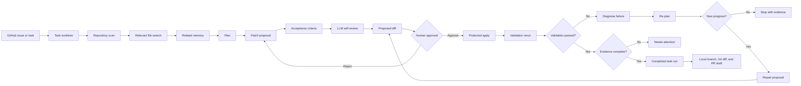

# RepoPilot Agent


[](https://github.com/CHOS1N11111/RepoPilot-Agent/actions/workflows/ci.yml)


RepoPilot Agent is a local coding workflow agent for turning GitHub issues, bug reports, or feature requests into reviewed, validated code-change proposals. It can create an isolated worktree for each task, scan the repository, retrieve relevant files, plan the work, ask an optional OpenAI-compatible LLM for patch proposals, wait for human approval, apply approved edits, rerun validation, and preserve the complete task state for recovery.

The project is designed around practical agent engineering: tool use, repository understanding, Git/GitHub awareness, structured LLM outputs, traceability, and human-in-the-loop safety.

## Agent Workflow

```text
Task or GitHub issue
-> isolated task worktree
-> repository scan
-> typed action-observation exploration
-> relevant file selection
-> related memory lookup
-> deterministic or LLM plan
-> patch proposal
-> proposal-scoped acceptance criteria
-> LLM self-review
-> proposed diff preview
-> human approval
-> protected file application
-> validation rerun
-> validation failure diagnosis and re-planning
-> bounded repair proposal
-> repeated-failure and repeated-proposal detection
-> completion evidence check
-> resumable task completion
-> Git diff, PR readiness, and PR draft support
```


```mermaid
flowchart LR
    A["GitHub issue or task"] --> S["Task worktree"]
    S --> B["Repository scan"]
    B --> C["Relevant file search"]
    C --> M["Related memory"]
    M --> D["Plan"]
    D --> E["Patch proposal"]
    E --> C1["Acceptance criteria"]
    C1 --> F["LLM self-review"]
    F --> G["Proposed diff"]
    G --> H{"Human approval"}
    H -->|Approve| I["Protected apply"]
    H -->|Reject| E
    I --> J["Validation rerun"]
    J --> L{"Validation passed?"}
    L -->|No| D1["Diagnose failure"]
    D1 --> P1["Re-plan"]
    P1 --> NP{"New progress?"}
    NP -->|No| ST["Stop with evidence"]
    NP -->|Yes| R["Repair proposal"]
    R --> G
    L -->|Yes| C2{"Evidence complete?"}
    C2 -->|No| X["Needs attention"]
    C2 -->|Yes| T["Completed task run"]
    T --> K["Local branch, Git diff, and PR draft"]
```

## Highlights

- 🧭 Dependency-light Python implementation using the standard library for the current MVP.
- 🖥️ Local web UI for task input, LLM settings, proposal review, timelines, GitHub state, and diffs.
- 🧠 Optional OpenAI-compatible LLM integration with deterministic fallback.
- Typed agent runtime for multi-step search, file reading, Git inspection, diff inspection, guarded edits, validation, user questions, and explicit finish actions.
- Ordered runtime events, action reservations, idempotent replay, and interruption recovery stored in local SQLite.
- Reproducible deterministic and LLM evaluation suites with explicit scoring and aggregate metrics.
- Managed detached Git worktree sandboxes for isolated proposal application and validation.
- Persistent sandboxed task runs with background execution, progress polling, safe pause/resume/cancel checkpoints, and restart recovery.
- Validation-aware completion with explicit acceptance criteria, execution budgets, and evidence for changed files, approval scope, and validation results.
- Automatic bounded repair generation after failed task-run validation, while keeping every repair patch behind human approval.
- No-progress detection for repeated validation failures, repeated proposals, no-op changes, and exhausted repair or execution budgets.
- ✅ Strict LLM JSON schema parsing for plans, patch proposals, and patch reviews.
- 🔍 LLM call traces with prompt previews, raw outputs, parse status, fallback state, and latency.
- 🧠 Local memory reuse for related previous runs, validation outcomes, and task summaries.
- 🧹 Memory controls for disabling lookup, deleting saved runs, and clearing local history.
- 📌 Pinned memory so users can prioritize important prior runs during planning.
- 🛡️ LLM self-review for proposed diffs before human approval.
- 🔐 Server-side proposal sessions so the browser applies proposals by `proposal_id`, not raw edits.
- 🧯 Rollback snapshots for reverting applied proposal edits without using destructive Git commands.
- 🧪 Validation command allowlist for safer test and lint execution.
- 🛠️ Validation feedback loop for failed tests, suspected files, and repair proposals.
- 🌿 Git workflow awareness for branch state, remotes, changes, diff stats, commit messages, PR readiness, and PR drafts.
- 🔗 GitHub awareness for open issues, pull requests, reviews, and CI/check status.
- 📦 Delivery draft panel for suggested commit messages, validation notes, PR readiness, PR-ready text, and explicit PR creation.

## Capability Map

| Area                   | What RepoPilot Does                                                                                   |
| ---------------------- | ----------------------------------------------------------------------------------------------------- |
| 📁 Repository scanning | Reads supported text files and ignores Git, dependency, build, cache, and local note paths.           |
| 🔎 Retrieval           | Scores files with task terms, path intent, symbols, multi-snippets, and source/test pairing.          |
| Agent runtime          | Executes typed tools, records action/observation events, and blocks unsafe automatic replay.          |
| Agent decision         | Validates a versioned decision envelope with one typed action, expected evidence, and state updates.   |
| Agent working state    | Persists bounded focus, findings, questions, selected paths, observations, and lifecycle snapshots.    |
| Agent context manager  | Rebuilds prioritized, section-budgeted, redacted context before every iterative decision.             |
| Iterative agent        | Uses the runtime under a read-only policy for bounded exploration before planning.                    |
| Repository map        | Indexes symbols, signatures, imports, dependencies, and source/test relations for task context.       |
| Structured patch      | Applies approved exact-text hunks with SHA-256 preconditions, conflict reports, and syntax checks.    |
| 🧭 Planning            | Builds deterministic plans or LLM-generated engineering plans.                                        |
| 🧩 Patch proposal      | Produces file-level change intent, risk notes, validation suggestions, and optional LLM file edits.   |
| 🧠 LLM governance      | Centralizes prompts, validates schemas, records traces, and runs patch self-review.                   |
| 🧠 Memory              | Retrieves related and pinned local run history and feeds concise lessons into planning.                |
| 🖐️ Web approval      | Stores proposals server-side, previews diffs, applies approved proposals, and supports rollback.      |
| 🧪 Validation          | Recommends commands, runs allowlisted checks, analyzes failures, and prepares repair context.         |
| Evaluation             | Scores retrieval, proposals, validation, Agent steps, LLM calls, latency, failures, and fallbacks.    |
| Worktree sandbox       | Creates isolated committed snapshots and guards dirty-source and destructive-removal operations.      |
| Task orchestration     | Runs the Agent in a sandbox, persists progress, waits for approval, validates, repairs, and resumes.   |
| Execution control      | Enforces Agent-step, tool-call, validation-command, and elapsed-time budgets with visible usage.       |
| Completion evidence    | Requires approved changes and passing required validation before a task run is marked complete.        |
| Repair loop            | Diagnoses failures, re-plans, proposes a bounded repair, detects repetition, and records stop evidence. |
| 🌿 Git                 | Inspects branch/upstream/ahead/behind, changed files, latest commit, diff stats, and PR readiness.    |
| 🔗 GitHub              | Reads issues, PRs, reviews, and CI/check status from the repository remote.                           |

## Architecture

```text
repopilot.py
  CLI entry point

src/repopilot_agent/
  scanner.py            repository file scanning
  search.py             lightweight relevance search
  repository_map.py     symbols, dependencies, source/test relations, and task ranking
  structured_patch.py   hash-guarded exact-text hunks and syntax/readback verification
  execution.py          acceptance criteria, execution budgets, usage, and completion evidence
  repair_loop.py        repair fingerprints, attempt history, progress decisions, and stop reasons
  agent_loop.py         LLM exploration adapter for the typed runtime
  agent_context.py      prioritized per-section context budgets, summaries, and secret redaction
  runtime/
    models.py           action, observation, event, policy, and run contracts
    tools.py            typed repository, Git, edit, and validation tools
    store.py            in-memory and SQLite action/event persistence
    state.py            versioned compact Agent working state and deterministic transitions
    loop.py             reusable policy-gated action-observation loop
  planner.py            deterministic and LLM planning
  patch_proposer.py     patch proposal and LLM patch review
  patch_apply.py        protected file edit application and rollback snapshots
  safety.py             structured pre-apply safety checks
  workflow.py           end-to-end local workflow
  validator.py          allowlisted validation runner
  validation_planner.py recommended validation command planner
  validation_feedback.py validation failure analysis and repair task builder
  evaluation.py         reproducible case loading, workflow scoring, and aggregate reports
  worktree_sandbox.py   managed detached Git worktree lifecycle and safety rules
  task_runs.py          persistent task-run state, checkpoints, and local branch delivery
  recovery.py           read-only recovery readiness and checkpoint integrity checks
  execution_profile.py  credential-free saved Agent configuration snapshots
  memory.py             SQLite history and related-run retrieval
  git_tools.py          local Git inspection
  git_summary.py        commit message and PR draft generation
  github_tools.py       GitHub REST API inspection
  repo_source.py        local path and GitHub URL resolution
  web_server.py         local stdlib HTTP server
  web_sessions.py       in-memory proposal sessions and timeline events
  context_builder.py    bounded LLM context packet construction
  llm/
    base.py             provider protocol and message model
    openai_compatible.py OpenAI-compatible client
    prompts.py          prompt templates
    schema.py           strict JSON parsers
    tracing.py          LLM call tracing
```

## Quick Start

Run the local workflow from the project root:

```bash
python repopilot.py run --repo . --task "fix search relevance for login behavior"
```

Run with validation:

```bash
python repopilot.py run --repo . --task "fix search relevance for login behavior" --validate "python -m unittest discover -s tests"
```

Print JSON output:

```bash
python repopilot.py run --repo . --task "inspect validation workflow" --json
```

For a complete walkthrough covering CLI usage, LLM setup, the web UI, GitHub URLs, diff review, validation repair, memory, and delivery drafts, see [docs/tutorial.md](docs/tutorial.md).

## Web UI

Start the local web UI:

```bash
python repopilot.py serve
```

Open:

```text
http://127.0.0.1:8765
```

The web UI supports:

- Repository source selection for local paths, GitHub URLs, or auto detection.
- Repository sync controls for cached GitHub clones, branch checkout, latest commit display, and local-change protection.
- Worktree sandbox creation, selection, refresh, and explicitly confirmed removal.
- One-click sandboxed task runs that automatically create and select an isolated worktree.
- A dedicated Task Run view with persisted phases, event history, polling, pause, resume, cancel, and recovery controls.
- 🧠 LLM model, API endpoint URL, and API key inputs.
- Automatic JSON mode compatibility retry for providers that do not support `response_format`.
- LLM connection testing before running the full workflow.
- Memory lookup toggle for clean-context runs.
- 📌 Task input and GitHub issue import.
- 🚦 Workflow execution and standalone proposal generation.
- 🔍 LLM input/output, self-review, and call trace inspection.
- 🕒 Agent timeline showing scan, search, plan, proposal, review, approval, apply, and validation events.
- 🧾 Proposed diff preview before file writes.
- 🖐️ Human-approved patch application by server-side `proposal_id`.
- Per-file approval controls so users can apply only selected proposal edits.
- Acceptance criteria, execution budget usage, and completion evidence in both Summary and Task Run views.
- SQLite-backed proposal sessions so apply, revert, timeline, and trace history can survive web server restarts.
- Rollback controls for reverting applied proposal edits from an internal pre-apply snapshot.
- Validation feedback panel with suspected files, bounded failure excerpts, repair steps, and repair proposal generation.
- Repair retry budget controls for bounded multi-attempt validation repair loops.
- 📦 Delivery draft generation for commit message, PR readiness, PR body preparation, and explicit PR creation.
- 🔗 GitHub issue/PR/review/check display.
- 🌿 Working tree and staged diff display.
- History controls for opening, reusing, pinning, deleting, or clearing saved runs.

API keys entered in the UI are sent only to the local server for that request and are not written to disk. LLM provider error previews redact the configured API key before showing diagnostics.

## Repository Sources

The web UI can analyze either a local repository path or a GitHub repository URL.

- Local path mode uses the directory exactly like the CLI `--repo` option.
- GitHub URL mode accepts inputs such as `https://github.com/owner/repo`, `git@github.com:owner/repo.git`, or `owner/repo`.
- GitHub repositories are cloned into a local cache under `.repopilot/repos/` before analysis.
- Existing cached clones are reused on later runs.
- Use `Sync Repository` to clone missing repositories, fetch remote updates, checkout a branch, and fast-forward pull cached clones.
- Branch input can select a remote branch during first clone or switch a clean cached clone to another branch.
- If local changes are present in the cached working tree, RepoPilot fetches metadata but skips checkout and pull.
- All patch previews, approved file writes, validation commands, Git diffs, and history records operate on the local cached working tree.
- Set `REPOPILOT_REPO_CACHE` to override the clone cache directory.

The first run for a GitHub URL requires `git clone` network access and any credentials required by that repository. RepoPilot still does not commit or push automatically. It can create a GitHub pull request only after the Delivery tab readiness checks pass and the user explicitly confirms the action.

## Git Worktree Sandboxes

Create an isolated detached worktree from the current committed `HEAD`:

```bash
python repopilot.py sandbox create --repo .
```

The command prints the sandbox path. Use that path as `--repo`, or select the sandbox from the Web UI. All RepoPilot scans, proposals, approved edits, validation commands, diffs, and local memory then operate inside the isolated worktree.

List managed sandboxes:

```bash
python repopilot.py sandbox list --repo .
```

Remove a clean sandbox:

```bash
python repopilot.py sandbox remove --repo . --path "C:/path/from/create"
```

RepoPilot requires the source worktree to be clean before creation because a Git worktree starts from a commit and cannot include uncommitted source changes. Sandboxes are created detached so they cannot accidentally advance the source branch. Removal is limited to registered worktrees under RepoPilot's managed root. A dirty sandbox is preserved unless removal is repeated with explicit `--force`:

```bash
python repopilot.py sandbox remove --repo . --path "C:/path/from/create" --force
```

By default sandboxes live under the operating system's temporary directory. Set `REPOPILOT_WORKTREE_ROOT` to use another directory outside the source repository.

## Sandboxed Task Runs

`Start Sandboxed Task` is the recommended end-to-end Web workflow. It creates a managed worktree from the clean committed source repository and runs exploration and proposal generation in a background worker. The Task Run tab tracks these phases:

```text
Sandbox -> Explore -> Approval -> Apply -> Validate -> Complete
```

When an apply-ready proposal is available, the run stops at `awaiting_approval`. Review the proposal and diff in the Summary tab, select the approved files, and use the existing protected Apply action. Passing validation completes the run. When LLM use and `Auto-generate repairs` are enabled, failed validation moves through `diagnosing` and `replanning` in the background, then returns to `awaiting_approval` with another human-reviewed proposal. With automation disabled, the run remains `repair_pending` for manual generation.

RepoPilot derives an acceptance contract from the task, approved proposal paths, and selected validation commands. The Task Run and Summary views show each criterion, configured limits, current usage, and final evidence. A run reaches `completed` only when at least one approved file changed, every changed file stayed inside the approved scope, and every required allowlisted validation command exited successfully. When no automated command is available, manual diff review remains visible as advisory evidence.

The Web settings expose limits for Agent steps, tool calls, validation commands, and elapsed execution time. RepoPilot checks command and tool budgets before applying files, records actual usage, and refuses completion when a configured budget is exceeded.

The repair loop fingerprints normalized validation failures and proposed file contents. It stops when an approved repair produces the same failure, the LLM repeats an earlier proposal, a proposal would not change the repository, no apply-ready proposal is produced, or a repair/execution budget is exhausted. Every attempt and stop reason is persisted and shown in the Repair Loop panels. Automatic generation never applies the repair: the new diff still requires explicit approval.

Task-run state is saved in the source repository's local SQLite database. Start the Web server from that repository or pass `python repopilot.py serve --repo PATH`; RepoPilot scans every persisted active task before serving requests. It marks unfinished work as `interrupted`, records the previous state, detection time, and `server_restart` reason, and persists a new task event. No LLM call, tool, validation command, or file operation is resumed automatically. Repeated scans are idempotent, and repositories selected later in the Web UI receive the same check when their task history is loaded. The interruption notice keeps the sandbox available for inspection before the existing Resume or Cancel action is chosen.

Manual Resume uses a persisted, exact-match checkpoint: `source_restart`, `sandbox_analysis`, `sandbox_inspection`, `approval`, or `repair_approval`. The Web UI shows the selected checkpoint and asks for explicit confirmation. Interrupted apply, validation, diagnosis, and re-planning states use `sandbox_inspection` because edits may already exist. A missing or dirty sandbox, stale checkpoint, missing confirmation, or invalid LLM configuration returns a conflict without changing the interrupted/paused task state. Successful resumes record the checkpoint, timestamp, and cumulative resume count; approval checkpoints return directly to human review without launching another worker.

Execution checkpoints are a separate audit history, not Resume Plan decisions. RepoPilot records a snapshot after each stable task boundary, including its monotonic sequence, phase and status, detail, intended next action, UTC timestamp, sandbox and proposal references, execution-budget usage and remaining capacity, and current repair attempt. The Task Run tab shows the latest snapshot and the 20 most recent entries; persistence keeps the latest 100 per run. Recording a checkpoint never resumes a worker or replays an LLM call, tool, patch, or validation command.

Before Resume, `Check Readiness` produces a read-only report for the current persisted state. It verifies the Resume Plan, latest execution-checkpoint references, required source or sandbox path, Git worktree readability and cleanliness, saved sandbox HEAD, and persisted proposal session for approval recovery. Missing execution history on a legacy task is a warning; mismatched references, changed HEAD, dirty worktrees, missing paths, and missing proposal sessions are blockers. Resume reruns the same checks server-side before changing status, so an older browser result cannot authorize recovery. Request-scoped LLM configuration is validated afterward and API keys are never included in the report.

Each new task also stores a versioned Saved Execution Profile containing its resolved LLM mode, model, JSON mode, fallback policy, memory and iterative settings, LLM timeout, automatic repair setting, retry limit, and execution budget. The complete provider endpoint is discarded after an SHA-256 fingerprint is computed, and API keys are never added to the profile. Older task records expose `execution_profile: null`.

Recovery Readiness now compares that saved profile with a temporary profile built from the current Web settings. The report classifies the result as `matched`, `changed`, or `legacy` and shows each changed field with its saved and current value. Endpoint differences use abbreviated SHA-256 fingerprints; complete URLs and API keys are never returned or persisted. A changed or missing legacy profile is a non-blocking warning in both Check Readiness and Resume, so repository safety checks remain the only readiness blockers in this version.

After a successful run, `Create Branch` can attach the sandbox to a validated local feature branch. This requires explicit confirmation and works only for a registered RepoPilot worktree. It does not stage, commit, push, or create a pull request.

## LLM Configuration

RepoPilot works without an LLM by using deterministic rules. To enable LLM-backed planning, patch proposals, and patch review:

```bash
python repopilot.py run --repo . --task "fix search relevance for login behavior" --use-llm
```

Use a specific model:

```bash
python repopilot.py run --repo . --task "fix search relevance for login behavior" --use-llm --model gpt-4o-mini
```

Disable deterministic fallback while debugging model output:

```bash
python repopilot.py run --repo . --task "fix search relevance for login behavior" --use-llm --no-llm-fallback
```

RepoPilot sends OpenAI JSON mode by default. If a compatible provider rejects `response_format`, RepoPilot automatically retries once without it. If the provider still returns a non-JSON response, RepoPilot reports the HTTP status, content type, and a short redacted body preview so you can diagnose gateway or endpoint issues. You can also disable provider-side JSON mode manually for debugging:

```bash
python repopilot.py run --repo . --task "inspect project docs" --use-llm --no-json-mode
```

Large patch-proposal prompts can take longer on API gateways. The default LLM request timeout is 120 seconds. Increase it from the CLI when needed:

```bash
python repopilot.py run --repo . --task "inspect project docs" --use-llm --llm-timeout 240
```

Enable read-only iterative agent mode when you want Codex-like multi-step exploration before planning and proposal generation:

```bash
python repopilot.py run --repo . --task "fix parser behavior" --use-llm --iterative-agent --agent-max-steps 6
```

In this mode, the LLM can choose bounded read-only actions such as `search_files`, `read_file`, `inspect_repository_map`, `inspect_git_status`, and `inspect_diff`. Every call must return the strict `AgentDecision` v2 envelope: a rationale, exactly one action with action-specific arguments, expected evidence, a bounded state update, a finish reason, and a user-question field. Unknown fields, unknown arguments, unsafe paths, invalid types, missing evidence, and invalid finish or question semantics are rejected before a tool runs.

These actions run through the same typed runtime used for guarded `inspect_diff`, `apply_patch`, `edit_file`, `run_command`, `validate`, `ask_user`, and `finish` tools. The current exploration policy enables only the read-only subset; approved edits continue to flow through patch proposals and human review. State updates are controller notes, not automatically accepted validation evidence.

`read_file` observations include a SHA-256 digest of the complete file even when the displayed content is truncated. The runtime's preferred write tool, `apply_patch`, accepts exact old/new text hunks plus that digest. It refuses stale files, missing or ambiguous hunk matches, and invalid Python or JSON output. Successful writes are read back and hashed again. Conflict observations are structured so a later agent step can re-read the file and prepare a new approved action instead of overwriting external changes.

Each runtime action has an action id and idempotency key. The controller uses one lifecycle for every read-only step: decide, record, authorize, execute, observe, update Working State, and either repeat or stop. RepoPilot persists ordered `decision_recorded`, `action_authorized`, `action_started`, `action_completed`, approval, input, recovery, replay, and `run_stopped` events. Denied and approval-required actions never receive `action_authorized`. A completed action is not executed again when retried with the same payload. If RepoPilot finds an unfinished reservation after a restart, it reports `recovery_required` instead of blindly repeating a possible file write or command.

Workflow JSON includes `agent_run_id`, `agent_events`, the latest `agent_state`, `agent_stop_reason`, and `agent_pending_question`. Working State v2 records the objective, current focus, bounded findings, bounded open questions, expected evidence, phase, status, iteration, selected paths, eight most recent bounded observation summaries, stop reason, and update time. Initial, per-step, and terminal snapshots are stored as `working_state_updated` runtime events, so reopening the SQLite event stream can recover the latest valid snapshot. Version 1 snapshots remain readable with empty defaults for the new fields. Complete file bodies, complete command output, API keys, and provider endpoints are not copied into these snapshots.

The CLI, Web Summary, and saved History views show the latest Agent Working State, explicit stop result, pending question when present, and ordered runtime timeline. Agent Steps also expose the rationale, action input, expected evidence, structured state update, observation, selected paths, finish reason, and user question. Each iterative prompt receives the compact state alongside recent observations. The core controller can opt into `ask_user` and stops with `input_required`; the CLI/Web workflow keeps this action disabled until a durable answer-and-resume path is available. The LLM controller remains read-only and all file changes still require proposal review and human approval.

Before every iterative decision, Context Manager v2 rebuilds one deterministic packet from nine prioritized sections: Working State, remaining execution budget, acceptance criteria, pinned memory, task-relevant Repository Map, current staged and unstaged Git diff, the three newest detailed observations, summarized older evidence, and initial ranked repository context. The packet has a 20,000-character total limit plus an explicit limit for every section. Higher-priority sections are assembled first; each trace reports section usage and whether content was full, truncated, omitted, or redacted.

Context sections pass through credential redaction before they reach the LLM. Common API-key, token, authorization, password, client-secret, private-key, OpenAI token, and GitHub token forms are replaced. This is a defense-in-depth filter, not permission to store secrets in tracked files.

Disable related memory lookup for a clean-context run:

```bash
python repopilot.py run --repo . --task "fix search relevance for login behavior" --no-memory
```

Environment variables:

- `OPENAI_API_KEY`: API key for the OpenAI-compatible provider.
- `OPENAI_API_URL`: Optional complete Chat Completions endpoint URL. Defaults to `https://api.openai.com/v1/chat/completions`.
- `OPENAI_BASE_URL`: Backward-compatible alias for the complete endpoint URL.
- `REPOPILOT_MODEL`: Optional default model name.
- `REPOPILOT_DISABLE_JSON_MODE`: Set to `1`, `true`, `yes`, or `on` to omit `response_format` for providers such as some API gateways.
- `REPOPILOT_LLM_TIMEOUT_SECONDS`: Optional LLM request timeout. Defaults to `120`.
- `REPOPILOT_WORKTREE_ROOT`: Optional directory for managed detached Git worktree sandboxes.

RepoPilot uses the configured endpoint URL exactly as provided. It does not append `/chat/completions` to the value.
See [`.env.example`](.env.example) for a secret-free configuration reference. RepoPilot does not load `.env` files automatically; set values in the process environment that starts the CLI or web server.

## LLM Context Management

RepoPilot builds explicit context packets before each LLM call. Planning receives compact ranked file previews, while patch proposal receives bounded file content for the most relevant files.

- Context packets have per-call character and file-count budgets.
- A bounded task-relevant repository map adds symbol signatures, imports, dependencies, and source/test relations without sending every file body.
- Iterative agent mode rebuilds a section-budgeted packet before every decision, keeping the newest three observations detailed and reducing older evidence to bounded deterministic summaries.
- Agent packets include Working State, remaining budget, acceptance criteria, pinned memory, Repository Map, current diff, observations, older evidence, and ranked repository context.
- LLM traces include file-packet diagnostics for planner/proposal calls and per-section full, truncated, omitted, and redacted diagnostics for Agent calls.
- Direct `file_edits` are accepted only for files whose full content fit into the patch context packet.
- If a file is too large and only a snippet was provided, RepoPilot keeps the model's file-level recommendation but blocks apply-ready edits for that file.

## Retrieval Quality

RepoPilot uses explainable local retrieval to decide which files should enter the agent context.

- Task terms are expanded with lightweight aliases and simple variants such as `parser` -> `parse`.
- Path-intent rules boost likely modules for web UI, GitHub/PR/CI, LLM, memory/history, and validation tasks.
- Python and JavaScript-like symbols receive extra weight when they match the task.
- File previews can include multiple matching snippets instead of only the first match.
- Source files and likely test files are paired so implementation and validation context travel together.

## Validation Planning

RepoPilot recommends validation before approved edits are applied.

- Python test files get direct `python -m unittest module.path` commands.
- Python source files prefer paired tests such as `tests/test_auth.py` when present.
- Python changes fall back to `python -m unittest discover -s tests` when no narrow test is found.
- JavaScript and TypeScript changes recommend `npm test` only when `package.json` exists.
- Documentation-only changes produce manual review notes instead of unsafe commands.
- Recommended commands are still run through the validation allowlist.

## Validation Feedback Loop

When validation fails, RepoPilot builds a bounded failure context instead of passing full logs around.

- Failed commands are summarized with exit code, extracted signals, and truncated output excerpts.
- Python and JavaScript-like file paths are extracted from tracebacks and command targets.
- Repair steps are generated from common signals such as assertion failures, import failures, syntax errors, and rejected commands.
- Sandboxed task runs can automatically diagnose the latest failure and generate a follow-up repair proposal.
- The manual `Generate Repair Proposal` action remains available when automation is disabled or automatic generation fails.
- Repair proposals still require human approval and use the same protected apply path as normal proposals.
- Repair attempts are counted on proposal sessions and capped by the web UI's `Repair max attempts` setting.
- Failure and proposal fingerprints detect repeated outcomes without persisting complete validation logs in the repair state.
- Stopped repair analyses retain their LLM traces in local History for inspection.
- When a retry or execution budget is exhausted, RepoPilot keeps the failure analysis visible but blocks new repair proposal generation.

## Evaluations

Run the built-in deterministic baseline without an API key:

```bash
python repopilot.py eval
```

The bundled suite uses three self-contained repositories for authentication, web UI, and GitHub branch-sync tasks. It scores relevant-file retrieval, top-file ranking, proposal files, plan shape, validation, LLM failures, and fallback stages. Memory is disabled so repeated runs remain comparable, and a failed case makes the command exit with status `1` for CI use.

Run the same cases through an LLM and the iterative Agent:

```bash
python repopilot.py eval --use-llm --iterative-agent --no-llm-fallback
```

Save a structured local result:

```bash
python repopilot.py eval --output evals/results/baseline.json
```

Evaluation never applies proposed edits. Saved reports omit API keys, raw prompts, and raw model outputs, and `evals/results/` is ignored by Git. See [evals/README.md](evals/README.md) for metrics, schema, fixtures, and case authoring.

## Git And GitHub

Inspect local Git state:

```bash
python repopilot.py git status --repo .
```

Generate a commit summary and PR draft:

```bash
python repopilot.py git summary --repo . --validation "python -m unittest discover -s tests"
python repopilot.py git pr-draft --repo . --validation "python -m unittest discover -s tests"
```

The web UI also includes a Delivery tab that generates the same kind of commit message and PR draft from the current working tree. It checks PR readiness, reports blockers such as dirty working trees or unpushed branches, suggests manual Git commands, and can create a GitHub pull request only after explicit user confirmation.

Inspect GitHub issue, pull request, review, and CI state:

```bash
python repopilot.py github status --repo .
```

Print GitHub state as JSON:

```bash
python repopilot.py github status --repo . --limit 10 --json
```

The GitHub command resolves the repository from the local `origin` remote. Public repositories can be read without a token, but `GITHUB_TOKEN` or `GH_TOKEN` is recommended for private repositories and higher rate limits.

RepoPilot reads bounded GitHub context for agent use:

- Open issue title, labels, body preview, URL, and recent comments.
- Open PR title, body preview, source/target branches, changed files, file stats, and patch previews.
- PR conversation comments and inline review comments.
- PR review states, review body previews, and reviewer metadata.
- Check runs, legacy statuses, conclusion, timing, and output summary previews.

## Local Memory

RepoPilot stores local web workflow history in SQLite under:

```text
.repopilot/memory.sqlite3
```

The memory layer records run metadata, tasks, summaries, proposal metadata, proposal sessions, task-run checkpoints, interruption metadata, proposed diffs, LLM traces, validation results, runtime action reservations, and ordered events. API keys are not stored. The web UI exposes this through the History and Task Run tabs, where previous runs, saved LLM trace history, runtime events, persisted proposal state, and resumable task state can be inspected.

RepoPilot adds `.repopilot/` to the clone's local Git `info/exclude` before writing state. This keeps local memory out of `git status` without changing or committing the repository's `.gitignore`.

Apply-ready proposal sessions are stored in the same SQLite database. If the web server restarts after proposal generation, RepoPilot can restore the proposal session from SQLite when the browser sends the same `proposal_id` with the repository input. Applied proposal rollback snapshots are also persisted so revert remains available across restarts unless the working tree files change after apply.

RepoPilot also reuses memory during planning. Before a new run creates a plan, it searches recent local history for related tasks and summaries, includes pinned runs selected by the user, then passes a compact memory context into the deterministic planner or LLM planner.

Memory context is intentionally bounded and inspectable:

- It includes task text, run summary, mode, applied/open status, match reasons, score, and saved validation command results.
- It does not inject stored API keys, raw LLM outputs, raw prompts, stdout/stderr logs, or proposal diff bodies into the planner prompt.
- Pinned runs are prioritized before ordinary related memory and appear in a separate planner prompt section.
- If memory is missing or unavailable, RepoPilot falls back to the normal repository scan and retrieval workflow.
- Use `--no-memory` in the CLI or Disable memory in the web UI to skip related-memory lookup for a single run.
- Use the History tab to pin/unpin important runs, delete one saved run, or clear the current repository history.

## Safety Model

RepoPilot is intentionally approval-first:

GitHub PR creation follows the same rule: RepoPilot checks readiness first, blocks dirty or unpushed branches, requires a non-base branch, and asks for explicit confirmation before calling the GitHub API.

- ✅ It previews proposed diffs before writing files.
- 🔐 It applies only server-stored proposal edits by `proposal_id`.
- It applies only the file edits approved in the Web UI; unchecked proposal edits are skipped.
- It persists proposal sessions and rollback state in SQLite so approval state is recoverable after restart.
- 🧯 It captures pre-apply rollback snapshots and refuses rollback if files changed again after apply.
- 🚧 It blocks repository escapes and sensitive paths such as `.git`, `.env`, and `log.md`.
- 🛡️ It runs structured safety checks for duplicate edits, unapproved paths, empty overwrites, large deletions, repeated generated content, and weak task relevance.
- 🧪 It runs validation commands only through an allowlist.
- It creates sandboxes only from clean committed state and removes only registered worktrees inside the managed root.
- It refuses to delete dirty sandboxes unless the user explicitly requests forced removal.
- It creates delivery branches only inside registered managed worktrees and only after explicit confirmation.
- It never persists task-run API credentials and never commits or pushes task-run changes automatically.
- API credentials used by automatic repair stay in the request-scoped background worker and are not serialized into task runs, proposal sessions, repair history, or saved reports.
- Side-effect runtime actions require action-scoped approval and an explicit file or command allowlist.
- Structured runtime patches require the SHA-256 observed during file read, exact hunk occurrence counts, pre-write syntax checks for Python and JSON, and post-write readback verification.
- Approved full-file proposals are converted into bounded exact-text hunks when possible; stale hashes or ambiguous matches stop the apply, and multi-file failures restore earlier writes from snapshots.
- Task runs are marked complete only after required acceptance evidence passes and the execution budget remains within its configured limits.
- Completed runtime actions are idempotent; interrupted reservations stop for recovery inspection instead of executing again automatically.
- 🧯 It keeps deterministic fallbacks for invalid or unavailable LLM output.
- 🔍 It exposes LLM traces and self-review output so decisions are inspectable.

## Tests

Run the test suite:

```bash
python -m unittest discover -s tests
```

Run the deterministic Agent evaluation baseline:

```bash
python repopilot.py eval --suite evals/cases
```

Compile-check Python files:

```bash
python -m py_compile repopilot.py src/repopilot_agent/*.py tests/test_workflow.py
```

GitHub Actions runs editable-install, compile, and unit-test checks on Python 3.10, 3.11, and 3.12. See [CONTRIBUTING.md](CONTRIBUTING.md) for local setup, development conventions, and pull request guidance.

## Roadmap

- 🧠 Add per-project memory policies and richer forgetting controls.
- ⚙️ Move the web backend to FastAPI when dependency-light constraints are relaxed.
- 🖥️ Build a richer React or Next.js dashboard for multi-run history and team workflows.
- 🧪 Expand the evaluation suite with benchmark tasks from real open-source issues.

## License

This project is licensed under the MIT License. See [LICENSE](LICENSE) for details.

## Status

RepoPilot Agent currently includes the CLI workflow, repository scanner, task-aware retrieval, a typed and persistent agent runtime, policy-gated tools, idempotent action recovery, iterative LLM exploration, related memory reuse, pinned memory, memory controls, deterministic planner, optional LLM planner, bounded LLM context management, strict LLM schema parsing, prompt templates, LLM call tracing, persisted LLM trace history, LLM patch proposal generation, LLM patch self-review, structured pre-apply safety checks, hash-guarded proposal patches, protected patch application, per-file Web approval controls, acceptance criteria, execution budgets, completion evidence, persisted proposal sessions, rollback snapshots, managed Git worktree sandboxes, persistent sandboxed task-run orchestration, safe pause/resume/cancel checkpoints, automatic bounded repair generation, repair progress fingerprints, no-progress stop decisions, explicit local branch delivery, validation planning, validation runner, reproducible workflow evaluations, Git workflow awareness, PR readiness checks, delivery draft generation, explicit GitHub PR creation, GitHub workflow awareness, SQLite-backed local memory, local web UI, timeline events, root launcher, and unit tests.
