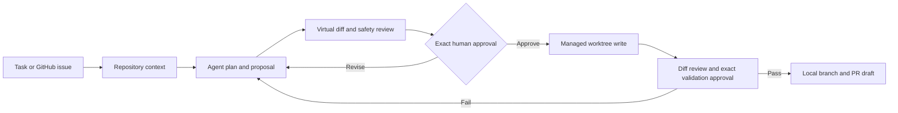

# RepoPilot Agent


[](https://github.com/CHOS1N11111/RepoPilot-Agent/actions/workflows/ci.yml)


English | [简体中文](docs/README.zh-CN.md)

RepoPilot Agent is a local, approval-first coding agent that turns repository tasks and GitHub issues into reviewable code-change proposals. It understands repository structure, plans with deterministic rules or an OpenAI-compatible LLM, previews exact diffs, applies only approved files, validates the result, and keeps Git delivery under user control.

[Quick Start](#quick-start) | [Tutorial](docs/tutorial.md) | [Architecture](docs/architecture.md) | [Evaluations](evals/README.md) | [Contributing](CONTRIBUTING.md)

## What It Does

- Builds task-aware repository context from files, symbols, imports, Git state, and source/test relationships.
- Runs a typed multi-step Agent loop with bounded context, parallel reads, persistent events, evidence-backed plans, and inspectable LLM traces and trajectories.
- Applies repository-local `AGENTS.md` guidance by directory scope without letting repository text override approvals, sandboxing, or secret handling.
- Produces reviewable virtual diffs and performs writes only in managed Git worktrees after exact, expiring human approval.
- Validates approved changes with bounded repair attempts, checkpoints, no-progress detection, and restart-safe recovery.
- Reads GitHub issues, pull requests, reviews, comments, changed files, and CI/check status.

## Workflow


```mermaid
flowchart LR
    A[Task or GitHub issue] --> B[Repository context]
    B --> C[Agent plan and proposal]
    C --> D[Virtual diff and safety review]
    D --> E{Exact human approval}
    E -->|Approve| F[Managed worktree write]
    E -->|Revise| C
    F --> G[Diff review and exact validation approval]
    G -->|Fail| C
    G -->|Pass| H[Local branch and PR draft]
```

Normal local Agent runs remain non-writing. In a sandboxed Task Run, writes must reproduce the latest inspected virtual revision, and every write or validation command pauses for exact approval. RepoPilot never commits or pushes task changes automatically.

## Quick Start

Requirements: Python 3.10+ and Git.

```bash
git clone https://github.com/CHOS1N11111/RepoPilot-Agent.git
cd RepoPilot-Agent
python -m venv .venv
```

Activate the environment with `source .venv/bin/activate` on macOS/Linux or `.\.venv\Scripts\Activate.ps1` in Windows PowerShell.

```bash
python -m pip install -e .
```

Run a deterministic repository analysis without an API key:

```bash
repopilot run --repo . --task "explain the agent workflow"
```

Run the iterative LLM Agent after configuring the environment variables described in [`.env.example`](.env.example):

```bash
repopilot run --repo . --task "improve repository search" --use-llm --iterative-agent
```

Start the local Web UI:

```bash
repopilot serve
```

Then open `http://127.0.0.1:8765`.

## Web UI

The local Web UI provides:

- Local or GitHub repository selection, synchronization, LLM configuration, and connection testing.
- Agent steps, Working State, context budgets, LLM traces, runtime events, durable questions, and read-only trajectory playback.
- Scoped `AGENTS.md` provenance, proposed changes, cumulative diffs, exact approvals, validation cycles, and rollback evidence.
- Sandboxed task controls, recovery readiness, History, and local branch delivery.
- GitHub issue, pull request, review, comment, and CI/check inspection.

API keys entered in the browser are sent only to the local server for that request and are not persisted.

## Common Commands

| Command | Purpose |
| --- | --- |
| `repopilot run --repo PATH --task "..."` | Analyze a repository and prepare a plan/proposal. |
| `repopilot serve --repo PATH` | Start the local Web UI. |
| `repopilot eval` | Run the deterministic evaluation suite. |
| `repopilot git status --repo PATH` | Inspect local branch and working-tree state. |
| `repopilot github status --repo PATH` | Inspect issues, pull requests, reviews, and checks. |
| `repopilot sandbox create --repo PATH` | Create an isolated detached worktree. |

## LLM Configuration

LLM support is optional. RepoPilot uses an OpenAI-compatible Chat Completions endpoint configured with `OPENAI_API_KEY`, `OPENAI_API_URL`, and optionally `REPOPILOT_MODEL`. The endpoint value is used exactly as provided; RepoPilot does not append `/chat/completions`.

Provider-side JSON mode is enabled by default and automatically retried without `response_format` when an API gateway rejects it. See the [Tutorial](docs/tutorial.md#step-3-run-with-an-llm) and [environment reference](.env.example) for complete setup and API-key safety guidance.

## Documentation

| Document | Contents |
| --- | --- |
| [Documentation Index](docs/README.md) | All project documentation entry points. |
| [Tutorial](docs/tutorial.md) | CLI, Web UI, LLM setup, GitHub sources, approvals, validation, repair, memory, and troubleshooting. |
| [Architecture](docs/architecture.md) | Runtime loop, Working State, context, patches, safety, worktrees, recovery, validation, and persistence. |
| [Evaluation Guide](evals/README.md) | Evaluation cases, metrics, LLM runs, and result files. |
| [Contributing](CONTRIBUTING.md) | Development setup, conventions, tests, and pull requests. |

## Safety

- Writes and validation commands require exact, expiring approval bound to payload, path, checkpoint, and current diff.
- Managed worktrees, command allowlists, SHA-256 preconditions, and repository-bound path checks contain side effects.
- Read-only actions may be retried, but interrupted writes and commands are never replayed automatically.
- API keys are request-scoped, redacted from diagnostics, and never stored in local history.

See the [Architecture safety model](docs/architecture.md#safety-summary) for the complete boundary.

## Development

```bash
python -m unittest discover -s tests
python repopilot.py eval
```

GitHub Actions runs compile and unit-test checks on Python 3.10, 3.11, and 3.12.

## License

RepoPilot Agent is available under the [MIT License](LICENSE).
