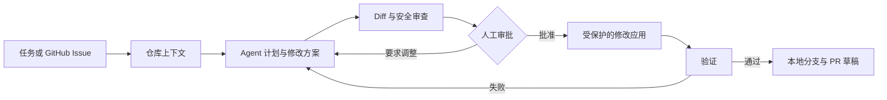

# RepoPilot Agent


[](https://github.com/CHOS1N11111/RepoPilot-Agent/actions/workflows/ci.yml)


[English](../README.md) | 简体中文

RepoPilot Agent 是一个在本地运行、以人工审批为先的编程 Agent，可将仓库任务和 GitHub Issue 转换为可审查的代码修改方案。它能够理解仓库结构，使用确定性规则或兼容 OpenAI API 的大模型制定计划，预览精确 Diff，仅应用用户批准的文件，验证修改结果，并将 Git 交付操作保留给用户控制。

[快速开始](#快速开始) | [使用教程](tutorial.md) | [架构设计](architecture.md) | [评测](../evals/README.md) | [贡献指南](../CONTRIBUTING.md)

## 核心功能

- 根据任务，从文件、符号、导入关系、Git 状态以及源码与测试的关联中构建仓库上下文。
- 运行带类型约束的多步骤 Agent 循环，支持上下文预算、持久化事件、证据驱动计划和可检查的 LLM Trace。
- 在不写入工作树的情况下生成带 SHA-256 保护的虚拟补丁和累积 Diff。
- 持久化有时效的精确 action 审批凭证，并绑定 payload 哈希、当前 Diff、checkpoint 以及文件或命令范围。
- 在服务端保存修改方案，并且只应用用户明确批准的文件。
- 在受管理的 Git Worktree 中执行完整任务，支持验证、有限次数的修复方案、检查点和重启恢复。
- 读取 GitHub Issue、Pull Request、Review、评论、变更文件以及 CI/Check 状态。

## 工作流程



Agent 探索和虚拟补丁过程不会写入仓库。真实文件修改必须经过明确审批，RepoPilot 也不会自动提交或推送任务改动。

## 快速开始

环境要求：Python 3.10+ 和 Git。

```bash
git clone https://github.com/CHOS1N11111/RepoPilot-Agent.git
cd RepoPilot-Agent
python -m venv .venv
```

在 macOS/Linux 上执行 `source .venv/bin/activate`，或在 Windows PowerShell 中执行 `.\.venv\Scripts\Activate.ps1` 来激活虚拟环境。

```bash
python -m pip install -e .
```

无需 API Key 即可运行确定性仓库分析：

```bash
repopilot run --repo . --task "explain the agent workflow"
```

按照 [`.env.example`](../.env.example) 配置环境变量后，运行迭代式 LLM Agent：

```bash
repopilot run --repo . --task "improve repository search" --use-llm --iterative-agent
```

启动本地 Web UI：

```bash
repopilot serve
```

然后打开 `http://127.0.0.1:8765`。

## Web UI

本地 Web UI 提供以下功能：

- 选择并同步本地路径或 GitHub URL 对应的仓库。
- 设置 LLM 模型、API 端点、API Key、超时时间和 JSON 兼容模式，并测试连接。
- 查看 Agent Steps、Working State、上下文预算、LLM 输入输出 Trace 和运行时事件。
- 查看修改方案和累积 Diff，逐文件审批，获取验证反馈并回滚修改。
- 查看沙箱任务进度，暂停、恢复或取消任务，检查恢复状态并准备本地分支交付。
- 查看 GitHub Issue、Pull Request、Review、评论以及 CI/Check 状态。

在浏览器中输入的 API Key 只会随当前请求发送给本地服务器，不会被持久化保存。

## 常用命令

| 命令 | 用途 |
| --- | --- |
| `repopilot run --repo PATH --task "..."` | 分析仓库并生成计划和修改方案。 |
| `repopilot serve --repo PATH` | 启动本地 Web UI。 |
| `repopilot eval` | 运行确定性评测套件。 |
| `repopilot git status --repo PATH` | 查看本地分支和工作树状态。 |
| `repopilot github status --repo PATH` | 查看 Issue、Pull Request、Review 和 Check 状态。 |
| `repopilot sandbox create --repo PATH` | 创建隔离的 detached Worktree。 |

## LLM 配置

LLM 是可选能力。RepoPilot 通过 `OPENAI_API_KEY`、`OPENAI_API_URL` 以及可选的 `REPOPILOT_MODEL` 连接兼容 OpenAI Chat Completions 的端点。RepoPilot 会直接使用所提供的端点地址，不会自动拼接 `/chat/completions`。

默认启用服务端 JSON Mode；如果 API 网关拒绝 `response_format`，RepoPilot 会自动在不使用该参数的情况下重试。完整配置和 API Key 安全说明见[使用教程](tutorial.md#step-3-run-with-an-llm)和[环境变量参考](../.env.example)。

## 文档

| 文档 | 内容 |
| --- | --- |
| [文档索引](README.md) | 所有项目文档入口。 |
| [使用教程](tutorial.md) | CLI、Web UI、LLM 配置、GitHub 仓库、审批、验证、修复、记忆与故障排查。 |
| [架构设计](architecture.md) | 运行时循环、Working State、上下文、补丁、安全、Worktree、恢复、验证与持久化。 |
| [评测指南](../evals/README.md) | 评测用例、指标、LLM 评测与结果文件。 |
| [贡献指南](../CONTRIBUTING.md) | 开发环境、项目约定、测试与 Pull Request。 |

## 安全边界

- 写入仓库的操作需要明确审批，并受已批准文件范围限制。
- Runtime 审批凭证会过期，不能授权已经变化的 payload、过期的文件基线或扩大的路径与命令范围。
- 精确补丁使用 SHA-256 前置条件，拒绝过期或存在歧义的修改。
- 验证命令必须通过允许列表检查。
- 敏感路径、仓库路径逃逸以及不安全的沙箱删除会被阻止。
- 受管理的任务 Worktree 会将批准的修改与源分支隔离。
- API Key 仅在单次请求中使用，会从诊断信息中脱敏，并且不会写入本地历史。

完整边界见[架构安全模型](architecture.md#safety-summary)。

## 开发

```bash
python -m unittest discover -s tests
python repopilot.py eval
```

GitHub Actions 会在 Python 3.10、3.11 和 3.12 上运行编译与单元测试检查。

## 许可证

RepoPilot Agent 使用 [MIT License](../LICENSE) 开源。
