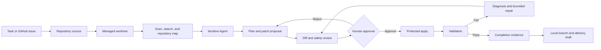

# RepoPilot Agent Architecture

This document describes RepoPilot's internal workflow and safety boundaries. For installation and user-facing commands, see the [Tutorial](tutorial.md).

## System Overview

RepoPilot turns a repository task into a reviewable change workflow. Repository analysis and proposal generation may use deterministic rules or an OpenAI-compatible LLM. Real file changes remain behind explicit human approval and execute inside a managed Git worktree when using the complete task workflow.



The major boundaries are:

1. Repository understanding is local and bounded.
2. LLM output is parsed as strict structured data.
3. Normal local Agent runs and all virtual patch actions do not write repository files.
4. LLM-selected writes are available only in registered managed worktrees, must match an inspected virtual revision, and require exact approval.
5. Validation and completion are evidence-based rather than inferred from model prose.
6. RepoPilot never commits or pushes task changes automatically.

## Main Modules

```text
repopilot.py
  CLI entry point

src/repopilot_agent/
  scanner.py             repository file scanning
  search.py              task-aware relevance search
  repository_map.py      symbols, dependencies, and source/test relations
  agent_context.py       bounded and redacted iterative context packets
  agent_loop.py          LLM decision loop adapter
  agent_write.py         exact approved-write continuation and diff observation
  structured_patch.py    exact-text patch checks and guarded writes
  patch_proposer.py      deterministic and LLM patch proposals
  patch_apply.py         protected file application and rollback snapshots
  execution.py           acceptance criteria, budgets, and evidence
  repair_loop.py         repair progress and no-progress detection
  workflow.py            end-to-end analysis workflow
  worktree_sandbox.py    managed detached Git worktrees
  task_runs.py           persistent sandboxed task orchestration
  recovery.py            read-only recovery readiness checks
  memory.py              SQLite history and related-run retrieval
  git_tools.py           local Git inspection
  github_tools.py        GitHub REST API inspection
  repo_source.py         local and GitHub repository resolution
  web_server.py          local HTTP API and static UI server
  runtime/
    approval.py          exact-action approval requests and expiring grants
    models.py            actions, observations, events, and policies
    tools.py             typed tool registry
    virtual_patch.py     run-scoped in-memory patch overlay
    state.py             versioned Agent Working State
    store.py             in-memory and SQLite event stores
    loop.py              authorize, execute, observe controller
  llm/
    openai_compatible.py OpenAI-compatible Chat Completions client
    prompts.py           module prompts
    schema.py            strict response parsers
    tracing.py           bounded LLM traces
```

## Repository Understanding

The scanner reads supported text files while excluding Git metadata, dependencies, build artifacts, caches, local RepoPilot state, and sensitive paths. Retrieval then ranks files using:

- Task terms, aliases, and simple word variants.
- Path intent for areas such as Web, GitHub, LLM, memory, and validation.
- Python and JavaScript-like symbols.
- Multiple matching snippets from a file.
- Likely source and test file pairs.

The Repository Map adds bounded structural context without sending every file body. It indexes Python classes, functions, methods, signatures, and imports, plus common JavaScript and TypeScript declarations and relative imports. Planner and proposal prompts receive only task-ranked map entries.

## LLM Boundaries

RepoPilot works without an LLM. When enabled, each LLM module has a separate prompt and strict parser:

- Planner: ordered engineering steps.
- Iterative Agent: one typed decision per call.
- Patch proposer: file-level intent and optional complete file edits.
- Patch reviewer: risk, concerns, test suggestions, and approval recommendation.

Context packets have character and file-count limits. Full file edits are accepted only for files whose complete content fit into the patch context. Large files may still receive recommendations, but they are not eligible for direct LLM-authored replacement content.

Before each iterative decision, Context Manager v2 rebuilds a prioritized packet from:

1. Agent Working State.
2. Remaining execution budget.
3. Acceptance criteria.
4. Pinned memory.
5. Task-relevant Repository Map entries.
6. Current staged and unstaged Git diff.
7. The newest detailed observations.
8. Summarized older evidence.
9. Initial ranked repository context.

Credential-like values are redacted before prompt construction. This is defense in depth; secrets still belong only in the process environment.

## Iterative Agent Controller

Every Agent call returns one versioned `AgentDecision` containing:

- A rationale.
- Exactly one typed action and action-specific arguments.
- Expected evidence.
- A bounded Working State update.
- A finish reason or user question when required by the action.

The non-writing action set includes:

- `search_files`
- `read_file`
- `inspect_repository_map`
- `inspect_git_status`
- `inspect_diff`
- `propose_patch`
- `inspect_proposed_diff`
- `finish`

The core controller can also support `ask_user`, but the top-level CLI and Web workflow keep it disabled until answers can be durably bound to the same paused run.

Each action follows one lifecycle:

```text
decide -> record -> authorize -> execute -> observe -> update state -> repeat or stop
```

The runtime persists ordered decision, authorization, action, observation, conflict, approval, recovery, replay, and stop events. Policy-denied and approval-required actions are never executed. Completed actions use idempotency records; interrupted reservations stop with `recovery_required` instead of being replayed blindly.

## Working State And Evidence

Working State v4 is a compact controller snapshot, not a transcript. It contains:

- Objective, focus, phase, status, iteration, and stop reason.
- Selected repository paths.
- Bounded findings and open questions.
- A mutable implementation plan.
- Required and optional acceptance criteria.
- Expected evidence and the eight newest bounded observations with action ids.
- Virtual-edit path, hash, revision, hunk-count, conflict, and inspection metadata.

Plan completion and acceptance success must cite prior completed evidence-producing action ids. Search candidates, future expectations, model findings, virtual proposals, user questions, and `finish` are not sufficient evidence. Required acceptance criteria cannot be downgraded by a later model response.

The controller blocks `finish` while any plan item is incomplete, required criterion lacks evidence, or virtual proposal is conflicted or uninspected. A blocked finish becomes another observation and the loop may continue within its existing budget.

Older Working State versions remain readable with empty defaults for fields introduced later. Complete file contents, provider endpoints, API keys, and command logs are not copied into snapshots.

## Virtual Proposed Edits

`propose_patch` uses a run-scoped in-memory overlay and never calls the repository write path.

The first proposal for a file must cite the complete-file SHA-256 returned by `read_file`. A revision must cite the latest virtual SHA-256 returned by the previous proposal. Exact hunks include old text, new text, and an expected occurrence count.

The overlay enforces path, UTF-8, target-size, hunk-count, hunk-size, occurrence-count, and Python/JSON syntax limits. It returns:

- The real baseline hash.
- The previous and resulting virtual hashes.
- Revision and cumulative hunk metadata.
- A cumulative unified diff from the real baseline to the latest virtual content.
- Structured stale-file, stale-revision, and hunk-match conflicts.

Every proposal and inspection rechecks the real file baseline. After an external change, the Agent must re-read the file and use its new hash to reset the virtual baseline. Inspecting the proposed diff marks the latest revisions reviewed; another revision makes inspection necessary again.

Complete virtual file contents are process-local. Working State and runtime observations preserve bounded metadata and diffs, but the overlay is not reconstructed automatically after a process restart.

## Proposal And Approval Boundary

The main workflow produces a server-stored patch proposal containing file intent, risks, validation suggestions, optional complete file edits, and a proposed diff. LLM-generated edits are filtered against the exact files whose complete context was available.

Before a real write, RepoPilot performs structured checks for:

- Duplicate or unapproved paths.
- Repository escapes and sensitive files.
- Empty overwrites and large deletions.
- Repeated generated content.
- Weak relationship to the requested task.
- Stale file hashes and ambiguous exact-text hunks.
- Invalid Python or JSON output.

The Web UI applies proposals by server-side `proposal_id`, not browser-supplied replacement content. Users approve files individually. RepoPilot captures rollback snapshots and refuses rollback when a file has changed again after application.

The lower-level write-capable `apply_patch` tool remains separate from non-writing `propose_patch`. Write and command tools require an explicit file or command allowlist plus action approval.

### Durable Runtime Approval Grants

Runtime side effects use a versioned approval protocol instead of trusting an action id by itself. Before an `edit_file`, `apply_patch`, `run_command`, or `validate` action can execute, RepoPilot creates a non-writing preview and persists an `approval_required` event containing:

- The exact typed action and action id.
- A canonical SHA-256 over the action, current file baselines, exact diff, file scope, and command scope.
- A unique request checkpoint and request timestamp.
- The exact repository-relative file scope or command allowlist.
- A bounded unified diff for file-changing actions.

The approving caller must echo the checkpoint, payload hash, file scope, and command allowlist exactly. A resulting grant is bound to the runtime run, action kind, and request checkpoint, and has a 15-minute default expiration with a 24-hour maximum.

Approval requests and grants are stored as ordered runtime events, so SQLite-backed runs retain them across process boundaries. Before execution, RepoPilot rebuilds the preview and verifies the current grant. It requires fresh approval when the action payload changes, a file baseline changes, the requested path or command expands, the checkpoint is stale, the request was rejected, or the grant expired. Successful authorization records `action_authorized` and `approval_consumed` before the side effect starts.

Completed idempotent side effects can replay their stored observation without performing the operation again. Interrupted reservations still stop with `recovery_required`.

Normal local iterative Agent runs remain non-writing. A sandboxed Task Run uses the same grant protocol for LLM-selected writes; normal Web proposal application continues to support server-stored proposal ids and per-file approval.

### Sandboxed Agent Write Loop

Task Runs may opt into `apply_patch` and `edit_file` decisions because they execute in a detached managed worktree. Runtime construction verifies that the target is a non-primary worktree registered by Git and located under RepoPilot's configured managed root. The policy contains an exact allowlist of scanned repository paths and does not expose command or validation actions at this milestone.

The controller accepts a write decision only when it reproduces the latest inspected virtual proposal for the same file. It rechecks the disk baseline, previews the requested content, and compares the resulting SHA-256 with the virtual revision hash. A mismatch becomes an `action_conflict`; it never creates an approval request.

An exact match follows this sequence:

1. Runtime creates and persists the exact approval request without writing.
2. The Task Run stops at `awaiting_approval`; no downstream planner or duplicate patch proposer call is made.
3. The Web caller echoes the checkpoint, payload hash, file scope, and empty command scope.
4. Runtime rechecks the payload and baseline, consumes the grant, and writes only the managed worktree.
5. The write observation records file existence plus before/after SHA-256 values.
6. Complete rollback content is stored in a separate `rollback_snapshot_recorded` runtime event under RepoPilot's ignored local state.
7. Runtime executes a read-only `inspect_diff`, appends both observations to Working State, and stops at `write_complete`.

The Task Run then enters `review_pending`: the resulting diff is ready for inspection, but post-write validation has not run and completion is not claimed. Integrating approved validation decisions into this same controller is the next workflow milestone. The approved-write continuation is deliberately limited to the one persisted pending action; it is not generic process-restart recovery.

## Worktree Sandboxes And Task Runs

A managed sandbox is a detached Git worktree created from a clean committed source `HEAD`. It isolates approved edits, validation, repair proposals, and delivery preparation from the user's source branch.

Sandbox creation fails when the source worktree is dirty because uncommitted changes are not represented by the source commit. Removal is limited to registered worktrees under RepoPilot's managed root. Dirty sandboxes are preserved unless forced removal is explicitly requested.

The persistent task-run lifecycle is:

```text
Sandbox -> Explore -> Approval -> Apply -> Validate -> Complete
```

Task runs execute in a background worker and expose progress, pause, resume, cancel, and recovery controls. Stable boundaries create checkpoints containing phase, status, next action, timestamps, sandbox/proposal references, and execution-budget usage.

After a server restart, unfinished runs become `interrupted`. RepoPilot does not automatically resume an LLM call, tool, patch, command, or validation process. Read-only readiness checks verify the saved checkpoint, source or sandbox path, Git cleanliness, sandbox `HEAD`, proposal session, and non-sensitive execution-profile compatibility before manual resume.

After successful validation, an explicitly confirmed delivery action can attach the sandbox to a local feature branch. It does not stage, commit, push, or open a pull request automatically.

## Validation, Repair, And Completion

Validation commands are recommended from changed file types and likely source/test pairs, then filtered through an allowlist. Documentation-only proposals receive manual review guidance instead of arbitrary commands.

Failed validation creates bounded feedback with exit status, extracted signals, suspected paths, short output excerpts, and repair steps. An LLM-backed sandboxed run may generate another proposal, but each repair remains behind human approval.

Repair progress fingerprints normalized failures and proposed file contents. The loop stops when it detects repeated failures, repeated proposals, no-op changes, missing apply-ready edits, or exhausted repair/execution budgets.

A task reaches `completed` only when completion evidence confirms that:

- At least one approved file changed.
- Every changed file stayed inside the approved scope.
- Every required allowlisted validation command passed.
- Configured execution budgets were not exceeded.

## Persistence And Memory

Local workflow state is stored in `.repopilot/memory.sqlite3`. The clone's local Git exclude file hides `.repopilot/` without modifying the repository's tracked `.gitignore`.

SQLite stores run metadata, summaries, proposal sessions, rollback snapshots, task-run state, checkpoints, interruption records, bounded LLM traces, validation results, action reservations, and ordered runtime events. API keys are not persisted.

Planning can retrieve recent related runs and explicitly pinned runs. Memory context is bounded to task text, summary, status, match reasons, score, and validation outcomes. Raw prompts, raw model output, complete logs, and proposal diff bodies are not injected as memory context.

## Git And GitHub

Local Git inspection reports branch, upstream, ahead/behind counts, remotes, latest commit, changed files, and diff statistics. Delivery helpers generate suggested commit messages, change summaries, PR readiness, and PR draft text.

GitHub inspection resolves the repository from `origin` and can retrieve bounded context for:

- Open issues and recent comments.
- Pull request metadata, branches, changed files, stats, and patch previews.
- Conversation comments and inline review comments.
- Review states and reviewer metadata.
- Check runs and legacy status contexts.

Public repositories can usually be read without a token. Private repositories and higher rate limits require `GITHUB_TOKEN` or `GH_TOKEN`. Pull request creation is an explicit user action and is blocked until local readiness checks pass.

## Safety Summary

RepoPilot's safety model is approval-first:

- Normal local Agent tools and all virtual proposal actions cannot modify the working tree.
- LLM-selected writes require a registered managed worktree and an exact match to the inspected virtual revision.
- Real edits are scoped to reviewed server-stored proposals.
- Runtime side effects require unexpired grants bound to the exact action, diff, and scope.
- File paths and validation commands are allowlisted.
- Sensitive paths and repository escapes are rejected.
- Hash preconditions prevent silent overwrite of newer content.
- Managed worktrees isolate task execution.
- Interrupted side effects stop for inspection instead of replaying automatically.
- API credentials remain request-scoped and are redacted from diagnostics.
- Task changes are never committed or pushed automatically.

For the current user workflow and troubleshooting steps, continue with the [Tutorial](tutorial.md).
